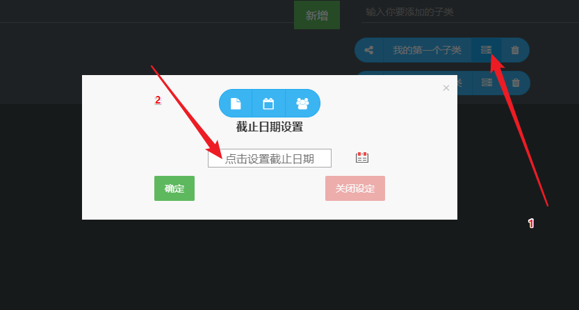
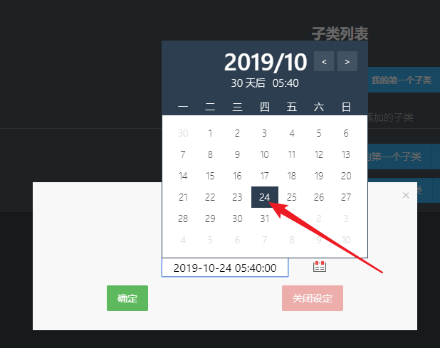
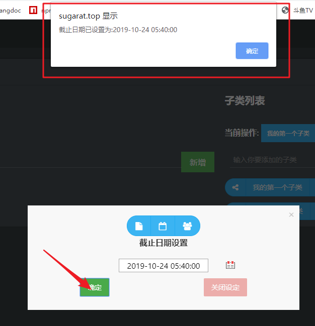
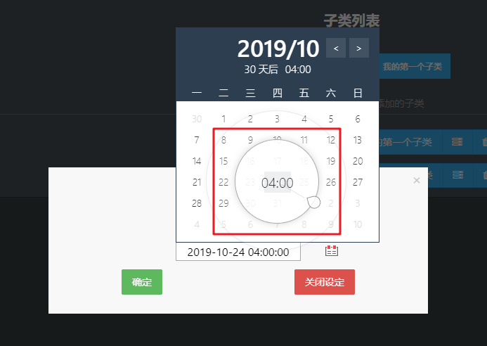
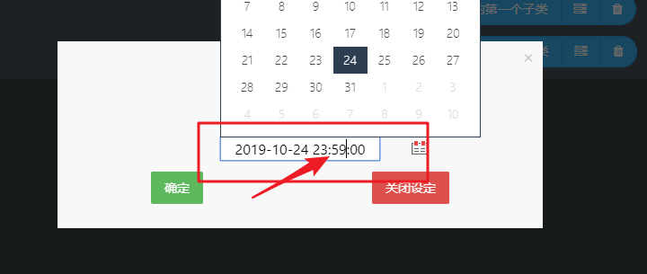
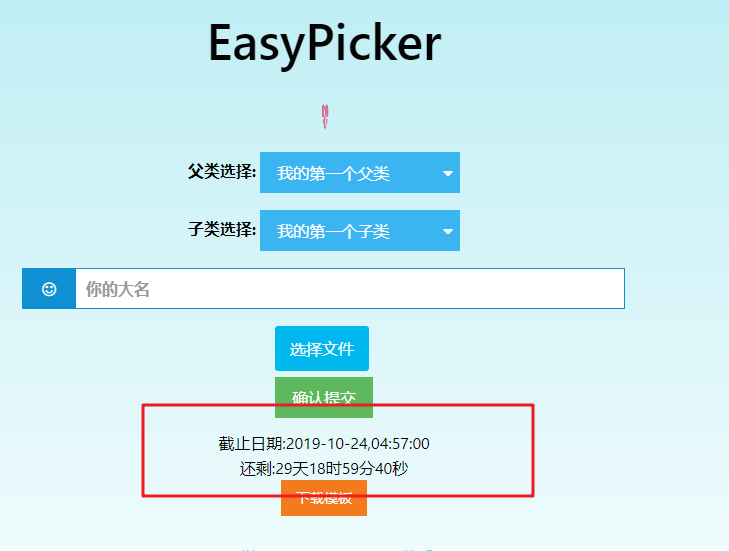

# 设置提交截止日期

截止日期的设置用于提醒用户在DDL之前提交文件,过了DDL之后就无法提交文件了.

## 第一步
打开子类的附加功能弹窗

## 第二步
选择设置截止时间面板(第二个)

## 第三步
点击输入框设置截止时间

## 第四步
点击确定完成时间设置

## 设置更详细的截止日期的方式(精确到时分)
1. 长按日期在小圈范围内设置(0-12),大圈设置13-23:50

2. 可在输入框更改详细的分

## 用户预览视图

