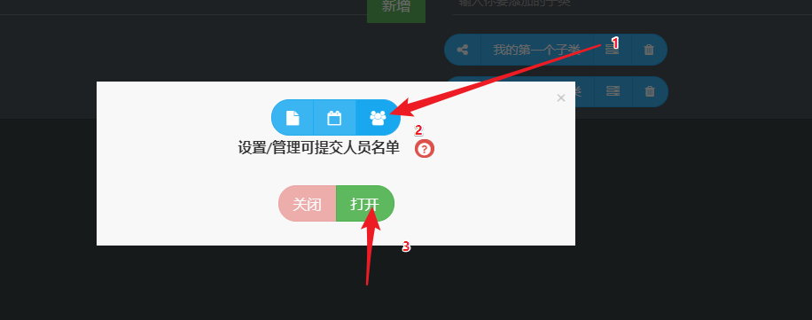
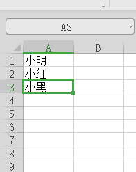
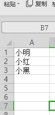
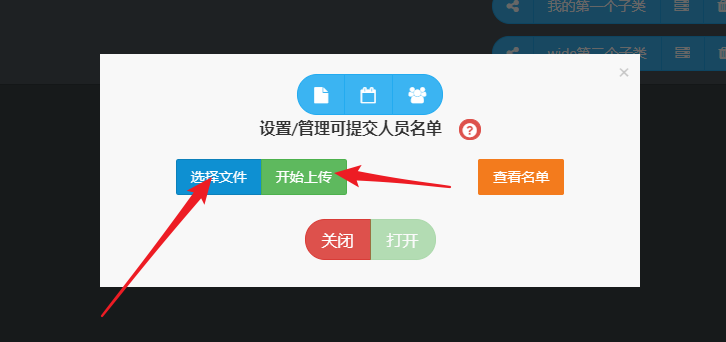
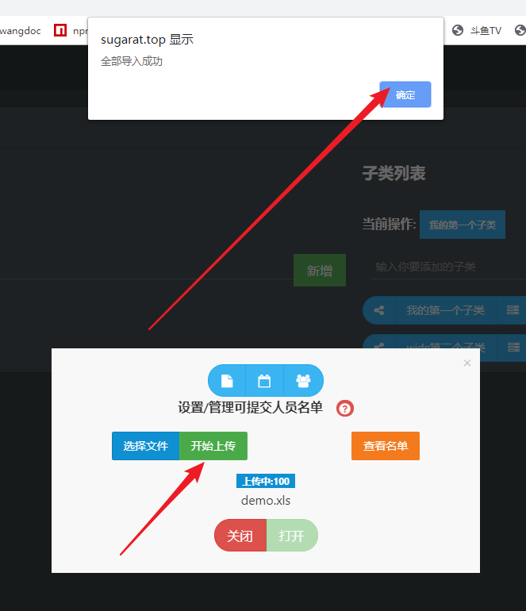
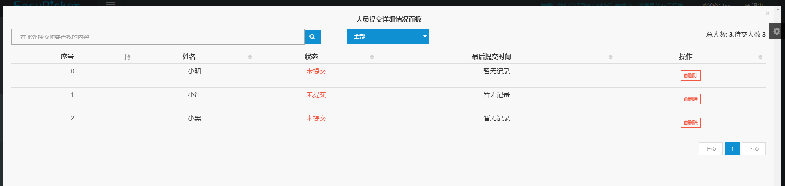

# 设置提交人员名单

人员名单用于限制提交人员,名单之外的人员不拥有提交权限,通过人员名单可清晰的知道文件提交情况.

如果设置了提交名单,用户重复提交时会提示用户已经提交过文件,是否再次提交.

## 步骤1
打开附加功能弹窗,选择人员管理面板人员,点击打开按钮,开启名单校验.




## 步骤2
点击选择文件按钮,选择包含名单的.txt或.xls或.xlsx

* txt文件格式
```text
小明
小红
小黑
```

* xls文件格式
  


* xlsx文件格式
  



## 步骤3
点击选择文件按钮,选择所需文件后点击上传





上传成功后名单限制即设置完成了,点击查看名单按钮查看名单内用户的提交情况



## 用户[预览](https://sugarat.top/EasyPicker/home/test?parent=%E6%88%91%E7%9A%84%E7%AC%AC%E4%B8%80%E4%B8%AA%E7%88%B6%E7%B1%BB&child=%E6%88%91%E7%9A%84%E7%AC%AC%E4%B8%80%E4%B8%AA%E5%AD%90%E7%B1%BB)


