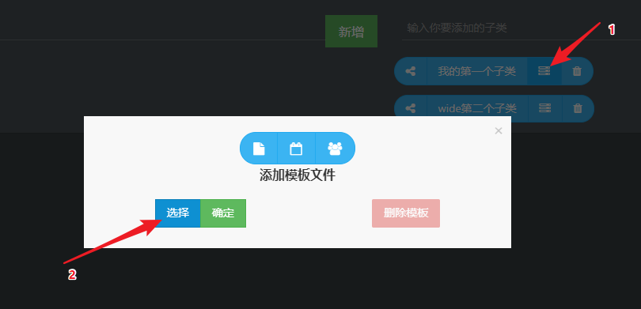
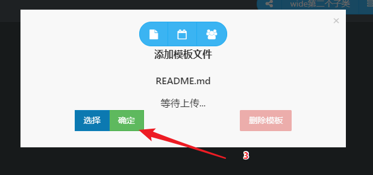
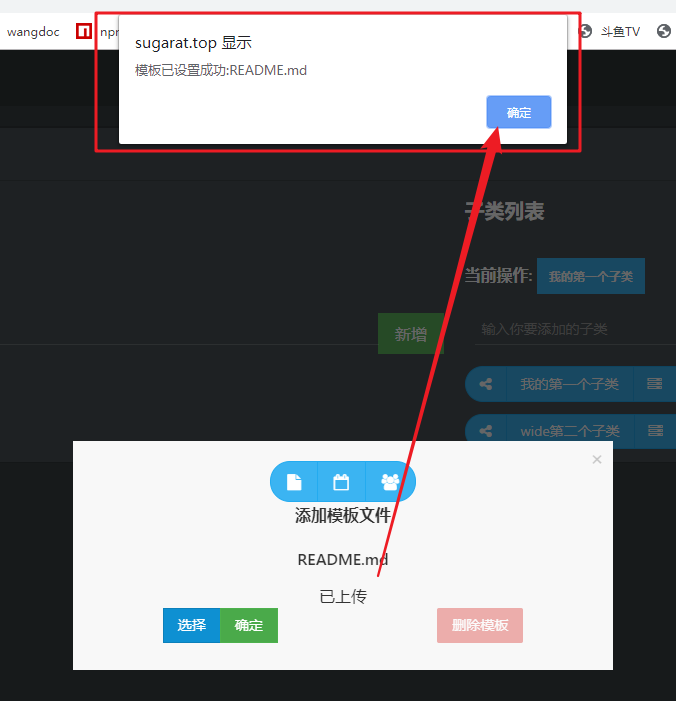
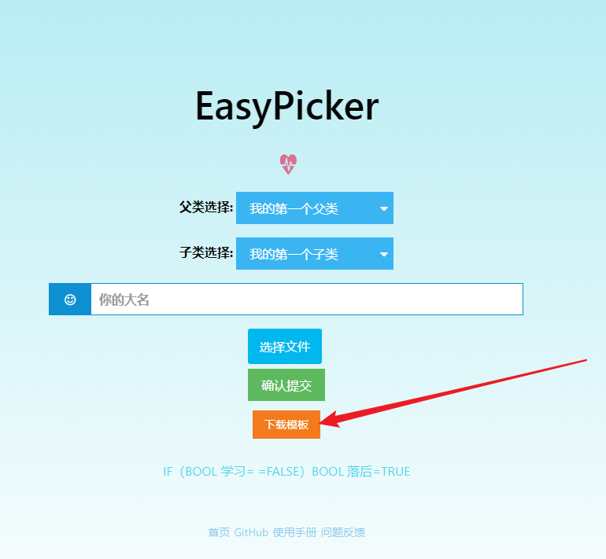

# 设置文件模板

文件模板可供提交用户下载提交文件的模板文件.

## 步骤1

打开子/父类的模板文件设置弹窗

## 步骤2

点击选择按钮,在资源管理器中选择要作为模板的文件,然后点击确定,提示上传完成后就算完成了

# 模板下载
用户可通过分享的文件收取链接处进行[模板下载](https://sugarat.top/EasyPicker/home/test?parent=%E6%88%91%E7%9A%84%E7%AC%AC%E4%B8%80%E4%B8%AA%E7%88%B6%E7%B1%BB&child=%E6%88%91%E7%9A%84%E7%AC%AC%E4%B8%80%E4%B8%AA%E5%AD%90%E7%B1%BB)

